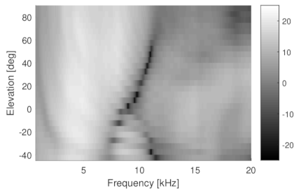
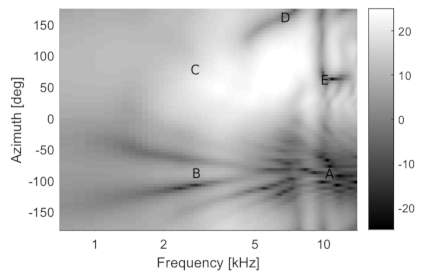
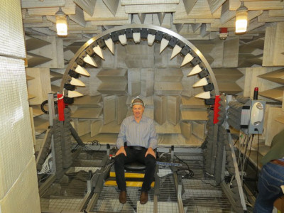
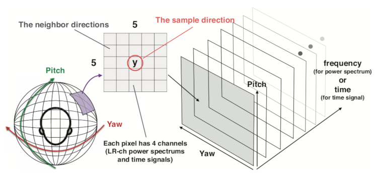
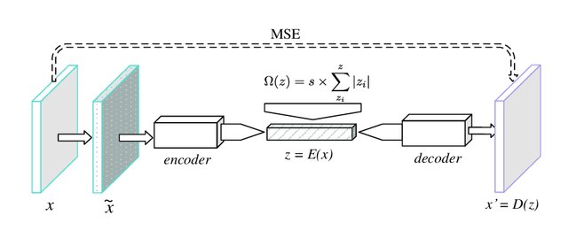
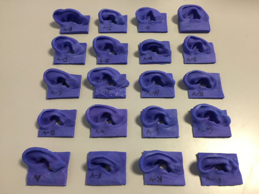
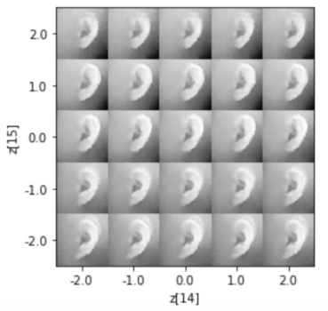
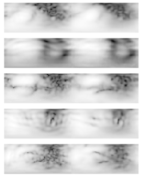
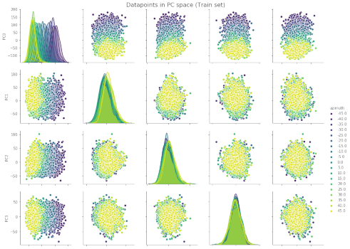
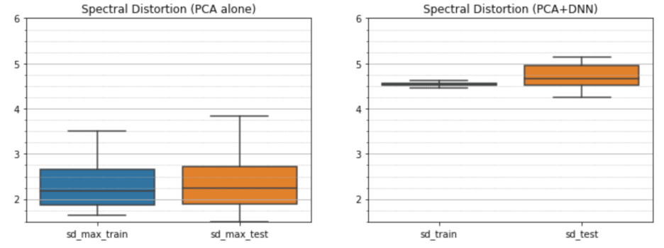

# Introduction

## Head-related transfer function
- Spectral cues allowing spatial hearing
- Frequency-domain transform of HRIR
- Depends on individual characteristics of torso, head, pinnae...

## Motivation
- Increasing number of applications for VR
- Required for immersive experience
- Measuring HRTFs is costly and time consuming

## Deep Learning
- Branch of Machine Learning
- Investigates models based on artificial neural networks
- Inspired by biological systems
- Recent resurgence

## Individualization tasks
- Selection 
- Adaptation
- Regression/Synthesis

## Individualization approaches
- Measurement
- Numerical analisys
- Anthropometric measurements
- Perceptual feedback

# State of the Art

## Yamamoto et al., 2017
- Variational autoencoder with adaptive layers, 3D convolutional layers
- Input data: HRTF+HRIR (5x5x128x4 patch), subject label (one-hot encoded vector), direction (26-dimensional vector)
- Training stage: reconstruct HRTFs, derive individual and non-individual factors
- Usage stage: use decoder to generate HRTF, calibrate individual factors using perceptual test

## Chen et al., 2019
- Variational autoencoder + DNN, fully-connected layers
- Input data: HRTF, anthropometrics features, azimuth
- Training stage: reconstruct HRTFs, predict latent variables from anthropometric data
- Usage stage: DNN derives latent variables from anthropometricss, VAE decoder generates HRTFs

# Techniques

## HRTF representation
- Single HRTF (vector)
- Frequency $\times$ Azimuth, Elevation (2D)
- *HRTF patch* (3D)
- Spherical harmonics
- Storage and exchange: SOFA format

## User data
- Anthropometric measurements
- Orientation-specific measurements
- 3D models (point cloud, 2d depth-map)

## DNN models
- Variational autoencoder
- Convolutional networks
- Multi-layer perceptron
- ResNet, Inception

 

## HRTF Datasets
- CIPIC (2001, HRIR, 34 subjects, anthropometrics)
- HUTUBS (2019, HRIR+SH, 96 subjects, anthropometrics + 3D scans)
- VIKING (2019, HRIR, 20 subjects, 3D scans)

# Current research

## Experiment framework
- Loading and processing data (HRTFs, ear pictures, anthropometric measurements, etc)
- Generating and training deep learning models 
- Calculating and visualizing results
- Libraries and tools: `keras`, `tensorflow`, `scipy`, `sklearn`, `seaborn`, `jupyter`

 

## Experiment log
- Ears VAE: use depth-maps of ears as predictors (instead of anthropometric measurements)
- HRTF VAE: auto-encode HRTF with different representations and assess correlation of latent dimensions with anthropometrics
- PCA+DNN: similar to Chen et al., but using DNN to predict first few principal components of HRTF

 

## Results and limitations
- Ears VAE: subpar reconstruction, observed mild correlation between latent variables and anthropometrics
- HRTF VAE: subpar reconstruction except with ResNet layers, almost no correlation with anthropometrics observed
- PCA+DNN: promising, spectral distortion of 4.7 dB

 

## Roadmap
- Use ear images instead of anthropometrics in PCA+DNN
- If better performances are achieved, substitute PCA with VAE decoder
- Integrate data from other datasets
- Implement testing environment

# References
- C. I. Cheng, “Introduction to Head-Related Transfer Functions (HRTFs): Representations of HRTFs in Time, Frequency, and Space,” J Audio Eng Soc, vol. 49, no. 4, p. 19, 2001.
- C. Guezenoc and R. Seguier, “HRTF Individualization: A Survey,” in Audio Engineering Society Convention 145, 2018.
- K. Yamamoto and T. Igarashi, “Fully perceptual-based 3D spatial sound individualization with an adaptive variational autoencoder,” ACM Trans. Graph., vol. 36, no. 6, pp. 1–13, Nov. 2017.
- T.-Y. Chen, T.-H. Kuo, and T.-S. Chi, “Autoencoding HRTFS for DNN Based HRTF Personalization Using Anthropometric Features,” in ICASSP 2019 - 2019 IEEE International Conference on Acoustics, Speech and Signal Processing (ICASSP), Brighton, United Kingdom, 2019, pp. 271–275.
- B. Fabian et al., “The HUTUBS head-related transfer function (HRTF) database,” 2019.
- S. Spagnol, K. B. Purkhús, R. Unnthórsson, and S. K. Björnsson, “THE VIKING HRTF DATASET,” p. 6, 2019.
